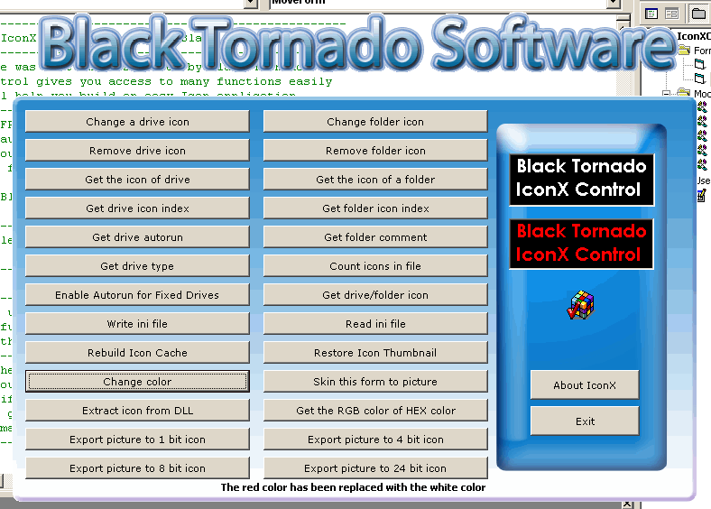



## IconX \- \[All In One\]

### Description

This hot code provides many powerfull functions for you READY-TO-USE, wich include (Change Folder Icon, Change Drive Icon, Rebuild Icon Cache, Export Picture To Icon (USING-API), Extract Icon from DLL, Count icons in file,Get a Drive of Folder Icon, Thumbnails for BMP files, Fix Explorer Icons, Skin form to Picture, Replace Color with another, Fix Icon Thumbnails, Read Ini file, Write Ini file, Get the RGB color of HEX color and many more...
 
### More Info
 
Please vote!!!

             |
---                |---
**Submitted On**   |2003-09-05 08:59:04
**By**             |[Black Tornado](https://github.com/Planet-Source-Code/PSCIndex/blob/master/ByAuthor/black-tornado.md)
**Level**          |Advanced
**User Rating**    |4.6 (23 globes from 5 users)
**Compatibility**  |VB 5\.0, VB 6\.0
**Category**       |[Graphics](https://github.com/Planet-Source-Code/PSCIndex/blob/master/ByCategory/graphics__1-46.md)
**World**          |[Visual Basic](https://github.com/Planet-Source-Code/PSCIndex/blob/master/ByWorld/visual-basic.md)
**Archive File**   |[IconX\_\(\_\_U164234962003\.zip](https://github.com/Planet-Source-Code/black-tornado-iconx-all-in-one__1-48315/archive/master.zip)

